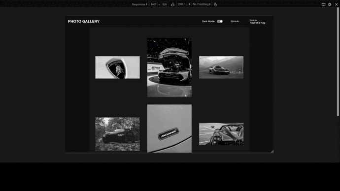
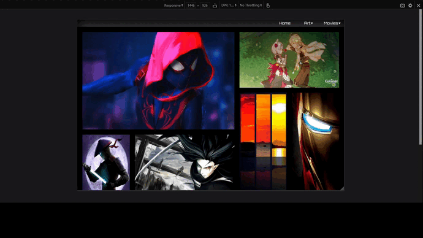

# Web Development Task-1

1. First of all, pull the upstream repository(like you did in Open Source Task-2) to update your local repository
2. Design a webpage having a photo gallery using flexbox or grid and make it a responsive site. You can design it, according to your creativity.
    **To know more about Flexbox and grid, you can refer the links below:-**
    * [Grid](https://web.dev/learn/css/grid/)
    * [Flex](https://web.dev/learn/css/flexbox/)
    * [Responsive Design](https://web.dev/learn/design/)
3. You can use images in the photo gallery, as per your own choice.
4. Next, you have to host your website on your GitHub Account. Click [here](https://youtu.be/QyFcl_Fba-k) to learn how to host a website in GitHub.
5. After completion of the above steps, make a folder of `Your Name` inside the `Web Development/task_1/` folder. Your folder path should look like `Induction-2022/Web Development/task_1/Your_Name`.

The folder `Induction-2022/Web Development/task_1/Pallav/` is uploaded for reference.

6. Inside your designated folder add your HTML file (name it as index.html), CSS file , a .txt file containing the URL of your webpage hosted on GitHub and a screenshot of your task. Make sure that you have added the images used in the website in the folder.
7. Finally commit your changes and create a pull request along with the URL of your webpage hosted in the description section of the Pull request.

## Deadline
15th April - 11:59 PM

## Examples

Example-1 
 
Example-2 

Notes:

<ol>
<li>This is just a layout, your website should contain images instead of coloured rectangles.
<li>The shape of your images can be anything- a square, rectangle, or a triangle? 🤔

If you are facing any problems or having any doubts feel free to ask in the discord server.

All the best!! 
Team Enigma 💚
