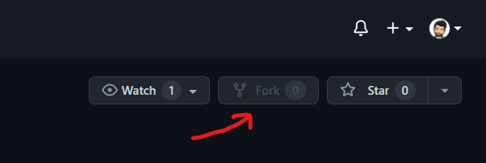
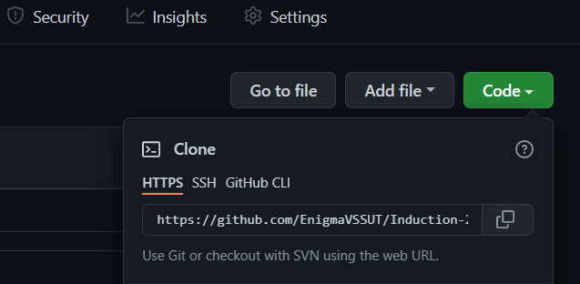
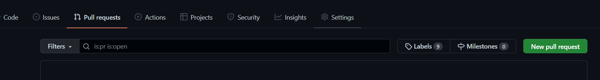

# Task 1

In this task, you'll learn basics of git and github.

## How to get started?
Head over to https://github.com/EnigmaVSSUT/Induction-2022 and click on the fork button. This creates a copy of this repository in your repositories so you can start working on the project without directly making changes in the owner's code.

  
  

  
  

Now, go to your profile and you should see Induction-2022 repository under your repositories. This is your forked repo.

## Start working! 

Now that you have your own copy of the repository it's time to make a copy of it on your local system so you can start contributing to the project. 

 
<ol>

<li>Now go to your forked repository, click on clone and copy the repo address. This will be used to clone the repository to your local system. </li>

 
The link might look different for you and will have your username in place of EnigmaVSSUT.
 
 
 
 <li>Go to the folder you'd like to make the copy of the repository and open git bash.
This can be done by right clicking inside the folder and selecting the "Git Bash here" option. You must have git installed in order for this command to show up in the menu.  </li>
 
Type the command <code>git clone <i>copied_repo_address</i></code>
 
 

<li>Now create a text file named <i>your_name.txt</i> inside the <code><b>open_source/Git1</b></code> folder. Add your details like <ul><li>name</li> <li>registration number</li><li>branch</li> <li>your hobbies</li> </ul>Now save the file.
 
For reference see the file [ravindra_nag.txt](ravindra_nag.txt) in the Git1 folder.
 
 

<li>Close any previous gitbash windows and open a new gitbash inside the newly cloned Induction-2022 folder. Then type <code>git add .</code> . This command adds all the changes you make to a staging area. This includes changes made in existing files as well as any new files that you create. Running the git add command does not change any of your work in the Git repository. Changes are only made to your repository when you execute the git commit command. </li>
 

<li>Now to commit these changes, type <code>git commit –m "git task 1 completed" </code> in the gitbash.  The commit message must contain useful information as to what changes you've made so that it is easier for others to understand what your code does. </li>
 

<li>After you've committed the changes you'd want these changes to reflect on your GitHub repository too. For that, type <code>git push origin main</code> in the gitbash. In Git, "origin" is a shorthand name for the remote repository that a project was originally cloned from. More precisely, it is used instead of that original repository's URL - and thereby makes referencing much easier. The git push command pushes all the changes to remote repository.</li> 
 

<li>Now go to the pull requests tab and click on "New pull request". Click through and create a pull request.  pull requests are a mechanism for a developer to notify team members that they have completed a feature. Once their feature branch is ready, the developer files a pull request via their GitHub account.  </li>

 
Wait till the pull request is approved and merged to the original repository.

</ol>
 

## Feel free to ask any doubts in the open source channel of our discord server

 
  
# Congrats on completing task 1 on git and GitHub! 
